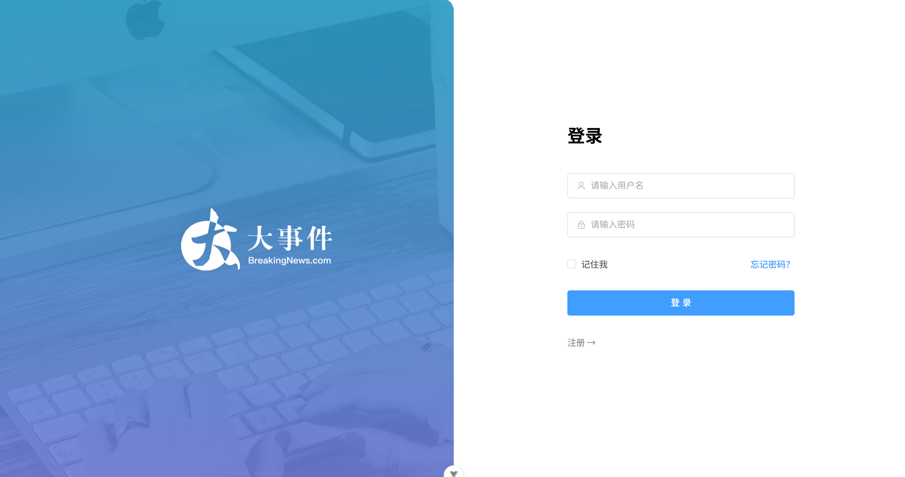
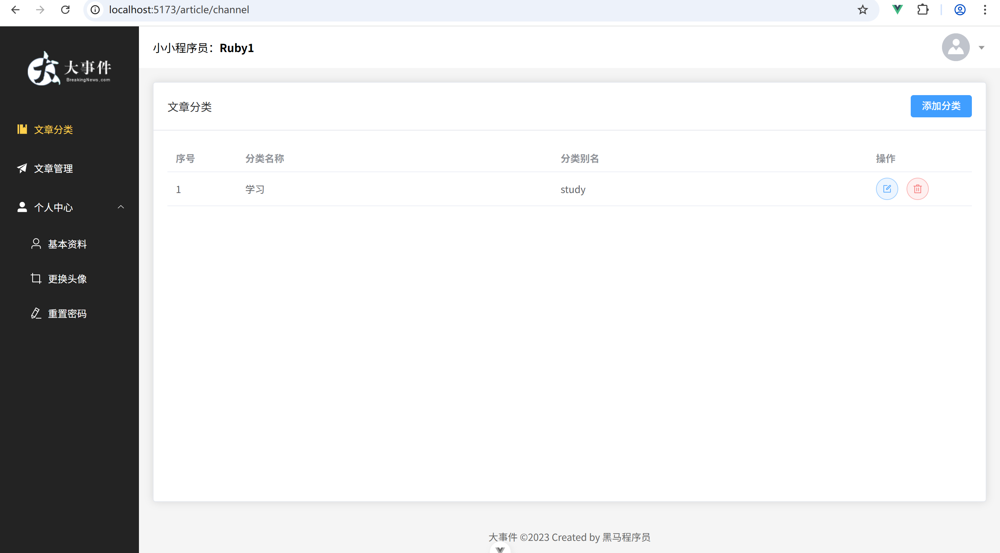
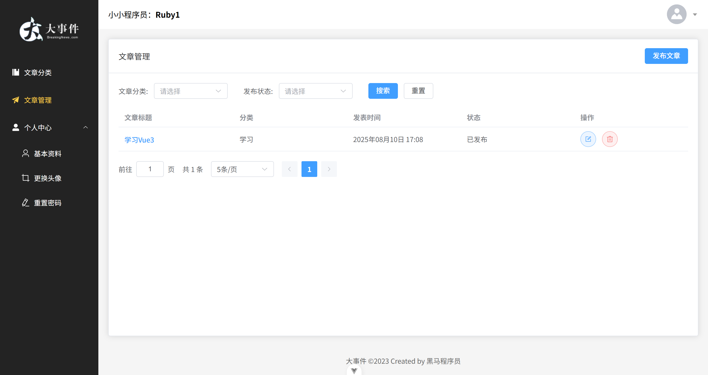
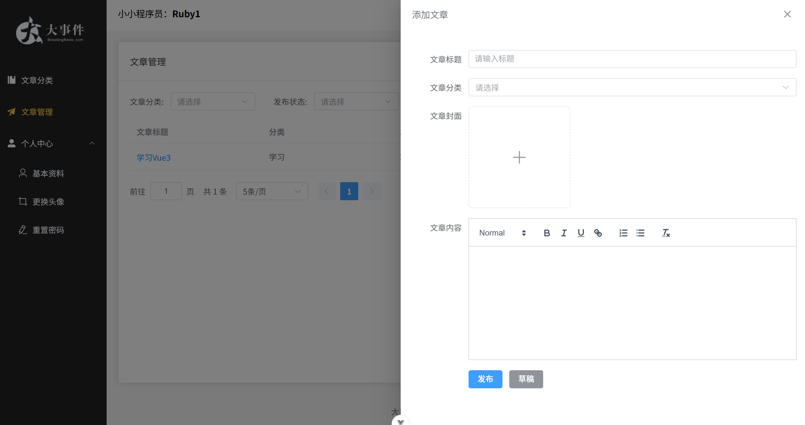

# Vue3-big-event-admin

基于 Vue3 实现的事件管理项目，跟随 B 站教程学习开发。

## 项目简介

- 技术栈：Vue3 + elementPlus+pinia+axios
- 功能特点：该项目是对事件进行管理，首先创建分类，然后根据选择分类添加文章。个人中心可对个人信息进行修改和展示。
- 学习目的：通过实践掌握 Vue3 核心概念

## 页面展示

- 登录页

- 分类管理

- 文章管理

## 致谢

感谢黑马程序员的教程指导

